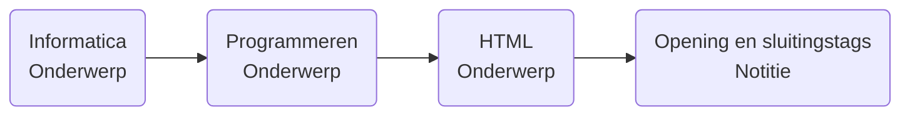

#gefinaliseerd 

🗂️ Onderwerp: [[🎒 Leren leren]], [[🧠 Ontwikkelen van OpenBrein]]
🎖️ Licentie: [CC BY-NC-SA 4.0](https://creativecommons.org/licenses/by-nc-sa/4.0/)
📅 Aangemaakt: 19-05-2024

> [!warning] Knowhow
> Pas op, je hebt iets van voorkennis van Obsidian nodig!

---
Ik werk met [Obsidian](https://obsidian.md) om notities te nemen - Dit kan beide een zegen en een zonde zijn om op te starten. Je hebt veel keuze en oneindig veel mogelijkheden. Voeg daar nog eens extensies aan toe en je vraagt gewoon om keuzestress.

Ik neem inspiratie van een aantal systemen:
* [PARA - Projects, Areas, Resources, Archive](https://fortelabs.com/blog/para/)
* [Zetelkasten](https://zettelkasten.de/overview/)
* [Atomic notes](https://www.notedexapp.com/blog/atomic-notes)

## Waarom niet gewoon X toepassen?
Ik vermelde dat ik inspiratie nam van al bestaande systemen, waarom pas ik ze niet gewoon toe i.p.v. al dat werk te steken in iets bestaands?

### Koppigheid & perfectionisme
Ik doe graag dingen zelf en als een klein ding van een systeem niet volledig aansluit bij wat ik wil dan doe ik het liever zelf. Ik vind de bovenstaande principes fantastisch, maar enkel voor hun exacte doeleinden

### Ik had al iets!
Vooraleer ik wist van al deze manieren van leren had ik mijn eigen principe uitgewerkt. In Google Docs kopieerde ik telkens een sjabloon Ze had als doelen:
* Gemakkelijk terug vinden van documenten voor kijkers van het document. - Als ik iets doorstuurde moest iedereen het kunnen verstaan, ongeacht of ze mijn layout al kenden of niet.
* Modulaire, herbruikbare notities - Een beetje gelijkaardig tot het 'Atomic notes' systeem. Je maakt een catalogus van kleine notities en linkt ze samen met hyperlinks. Zo moet je niet constant hetzelfde herhalen. Je kan notities telkens opbouwen met nieuwe kennis door ideeën te linken met elkaar van totaal andere vakgebieden. Dit ontwikkeld jouw verstaan van het originele idee en alles errond!

![[Pasted image 20240519140613.png]]

## Hoe werkt het?

### Principe
Je start altijd met een onderwerp vooraleer je een notitie begint. Zo'n onderwerp kan maximaal twee sub-onderwerpen hebben. 

Deze onderwerpen staan allemaal in een map 'Onderwerpen' en zijn gewoon markdown pagina's. Wanneer je een notitie maakt link je gewoon het best toebehorende onderwerp. Op de pagina van dit onderwerp wordt deze link in de 'Backlinks' sectie automatisch doorgegeven.

>[!info] Voorbeeld
>Je moet een notitie nemen in de les Informatica en het gaat over netwerken - Je zal je notitie dus in het onderwerp 'Netwerken' onder 'Informatica' zetten. Het is net een folderstructuur.

### In Obsidian
Mijn vault lijst eerst de onderwerpen zodat ik niet meerdere keren hetzelfde onderwerp aanmaak. Hierna zie je de notities a.d.h.v. het zetelkasten systeem waar ze allemaal in dezelfde map staan.

![[Pasted image 20240519155743.png]]

## Waarom?
Mijn notities zijn publiekelijk beschikbaar dus iedereen moet gemakkelijk kunnen browsen naar het onderwerp waarin ze geïnteresseerd zijn. Het zorgt er ook voor dat mijn Obsidian graph er leuk uitziet!

---