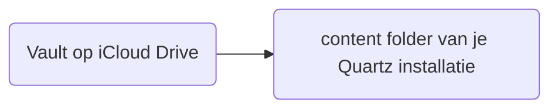

#guide  #bezig

🗂️ Onderwerp:  [[🧠 Ontwikkelen van OpenBrein]]
🎖️ Licentie: [CC BY-NC-SA 4.0](https://creativecommons.org/licenses/by-nc-sa/4.0/)


>[!warning] Knowhow
>Je moet een Quartz installatie hebben ([[Quartz installatie]]) en jouw Obsidian vault moet via iCloud gesynchroniseerd staan ([[iCloud linken met Quartz installatie]]).

---
## Inleiding
### Doel
Oké we hebben nu een Obsidian vault in de cloud op iCloud en een lege Quartz content folder, we willen nu:


## Manueel synchroniseren
### Copy - paste!
Wil je écht volledige controle over wat er online wordt gepubliceerd? - Dan kan je je notities manueel van je iCloud drive kopiëren naar de Quartz content folder.

![[Pasted image 20240518231504.png]]
### Synchronise~
Nu moeten we een terminal openen in de Quartz hoofdfolder, in mijn geval `C:\Users\jelle\OpenBrein` en het synchroniseer commando uitvoeren.

``` PowerShell
npx quartz sync 
```

## Automatiseren


---