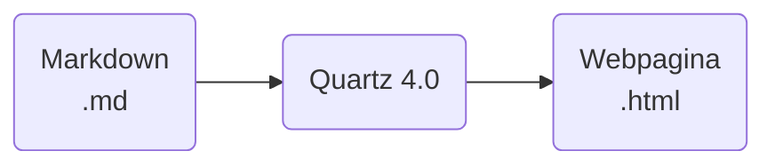

#documentatie  #afgerond

🗂️ Onderwerp:  [[🧠 Ontwikkelen van OpenBrein]]
🎖️ Licentie: [CC BY-NC-SA 4.0](https://creativecommons.org/licenses/by-nc-sa/4.0/)

>[!info] Bronnen
>[How to publish your notes for free with Quartz - Nicole van der Hoeven](https://youtu.be/6s6DT1yN4dw)
>[Quartz documentatie](https://quartz.jzhao.xyz/)

---

# Inleiding
## Wat is Quartz?
Quartz is een vertaler die markdown bestanden omzet in html pagina's met dezelfde lay-out als Obsidian. Dit maakt het gemakkelijk om jouw notities dan online te publiceren.


## Hoe ik Quartz gebruik
Na het omzetten van je bestanden met Quartz kan je deze via een webserver online zetten. Ik heb mijn Quartz installatie via Git op Github gezet en dan Github Pages gebruikt om de webpagina te hosten.

## Benodigdheden
Voor een juiste installatie van Quartz hebben we twee grote benodigdheden nodig
* NodeJS en NPM
* Git versie controle

# Quartz afhalen
Vooraleer we iets kunnen doen moeten we Quartz afhalen van Github met Git. 
## Doelmap
Zoek ergens op je computer waar je Quartz wilt opslaan, dit moet een permanente locatie zijn aangezien we ze later met Node moeten initialiseren als een omgeving. Ik koos bijvoorbeeld 'C:/Users/Jelle', mijn thuismap.

![[Pasted image 20240518144526.png]]

## Terminal openen
Open een terminal of cd naar jouw doelmap

![[Pasted image 20240518144855.png]]

## Afhalen via Git
Voer het git clone commando uit in jouw doelmap, ze maakt automatisch een mapje 'quartz' aan met alles dat in de huidige Quartz 4.0 repository staat.

``` PowerShell
git clone https://github.com/jackyzha0/quartz.git
```

``` Output
PS C:\Users\jelle> git clone https://github.com/jackyzha0/quartz.git
Cloning into 'quartz'...
remote: Enumerating objects: 8843, done.
remote: Counting objects: 100% (21/21), done.
remote: Compressing objects: 100% (21/21), done.
remote: Total 8843 (delta 7), reused 9 (delta 0), pack-reused 8822
Receiving objects: 100% (8843/8843), 6.80 MiB | 6.77 MiB/s, done.
Resolving deltas: 100% (5465/5465), done.
```

## * Nieuwe naam geven
Als je wilt kan je het mapje een nieuwe naam geven, je doet dit best nu of je zult later problemen krijgen wanneer de omgeving aangemaakt is via Node. Je kan dit grafisch doen of als je terminal nog open staat met het `mv` commando in Windows.

``` Powershell
mv quartz naam_map
```


## In je map gaan
Nu dat je quartz hebt afgehaald moeten we ons nog in de map begeven, we doen dit met `cd` of grafisch door op de map te klikken
``` PowerShell
cd .\naam_map\
```

## Initialiseren en aanmaken Quartz
Quartz is gebouwd en afhankelijk van NodeJS en npm, hierdoor moeten we onze omgeving initialiseren en 'creëren' zodat ze alle afhankelijkheden afhaalt. Dit doen we a.d.h.v. de volgende commando's.
``` PowerShell
npm i
```

``` Output
PS C:\Users\jelle\testvault> npm i

added 514 packages, and audited 516 packages in 14s

178 packages are looking for funding
  run `npm fund` for details
```

En nu maken we onze Quartz installatie aan:

``` PowerShell
npx quartz create
```

## Configureren Quartz
Na het vorige commando te runnen zal hij vragen voor enkele opties te selecteren, kijk wat voor jou toepasselijk is. - Meestal laat je het best gewoon op de default opties. (Je navigeert met pijltjes en selecteert met enter)

``` Output
PS C:\Users\jelle\testvault> npx quartz create

T   Quartz v4.2.3
|
*  Choose how to initialize the content in `C:\Users\jelle\testvault\content`
|  > Empty Quartz
|    Copy an existing folder
|    Symlink an existing folder
```

``` Output
T   Quartz v4.2.3
|
o  Choose how to initialize the content in `C:\Users\jelle\testvault\content`
|  Empty Quartz
|
*  Choose how Quartz should resolve links in your content. This should match Obsidian's link format. You can change this
later in `quartz.config.ts`.
|  > Treat links as shortest path ((default))
|    Treat links as absolute path
|    Treat links as relative paths
```

``` Output
T   Quartz v4.2.3
|
o  Choose how to initialize the content in `C:\Users\jelle\testvault\content`
|  Empty Quartz
|
o  Choose how Quartz should resolve links in your content. This should match Obsidian's link format. You can change this
later in `quartz.config.ts`.
|  Treat links as shortest path
|
—  You're all set! Not sure what to do next? Try:
  • Customizing Quartz a bit more by editing `quartz.config.ts`
  • Running `npx quartz build --serve` to preview your Quartz locally
  • Hosting your Quartz online (see: https://quartz.jzhao.xyz/hosting)

```

## Testen op je PC
Om te zien hoe jou Quartz er uitziet kan je de `build --serve` optie gebruiken.

``` PowerShell
npx quartz build --serve
```

``` Output
PS C:\Users\jelle\testvault> npx quartz build --serve

 Quartz v4.2.3

Cleaned output directory `public` in 6ms
Found 1 input files from `content` in 10ms
Parsed 1 Markdown files in 128ms
Filtered out 0 files in 62μs
Emitted 11 files to `public` in 91ms
Done processing 1 files in 240ms
Started a Quartz server listening at http://localhost:8080
hint: exit with ctrl+c
[200] /
[200] /index.css
[200] /prescript.js
[200] /postscript.js
[200] /static/contentIndex.json
[200] /static/icon.png
```

Door te surfen naar http://localhost:8080 na het commando te runnen kan je je website zien.

![[Pasted image 20240518154330.png]]

---
#### **⛓️ Verwijzingen:**
* [[Quartz hosten op Github Pages]]
* [[Quartz openen in Obsidian]]
